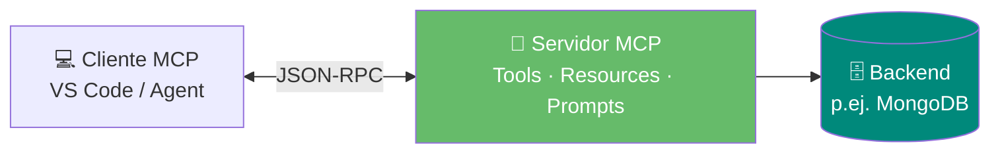
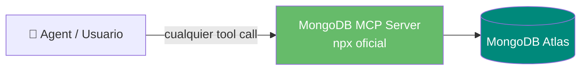
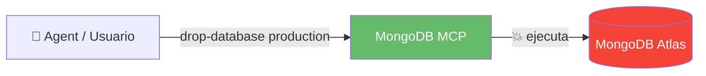
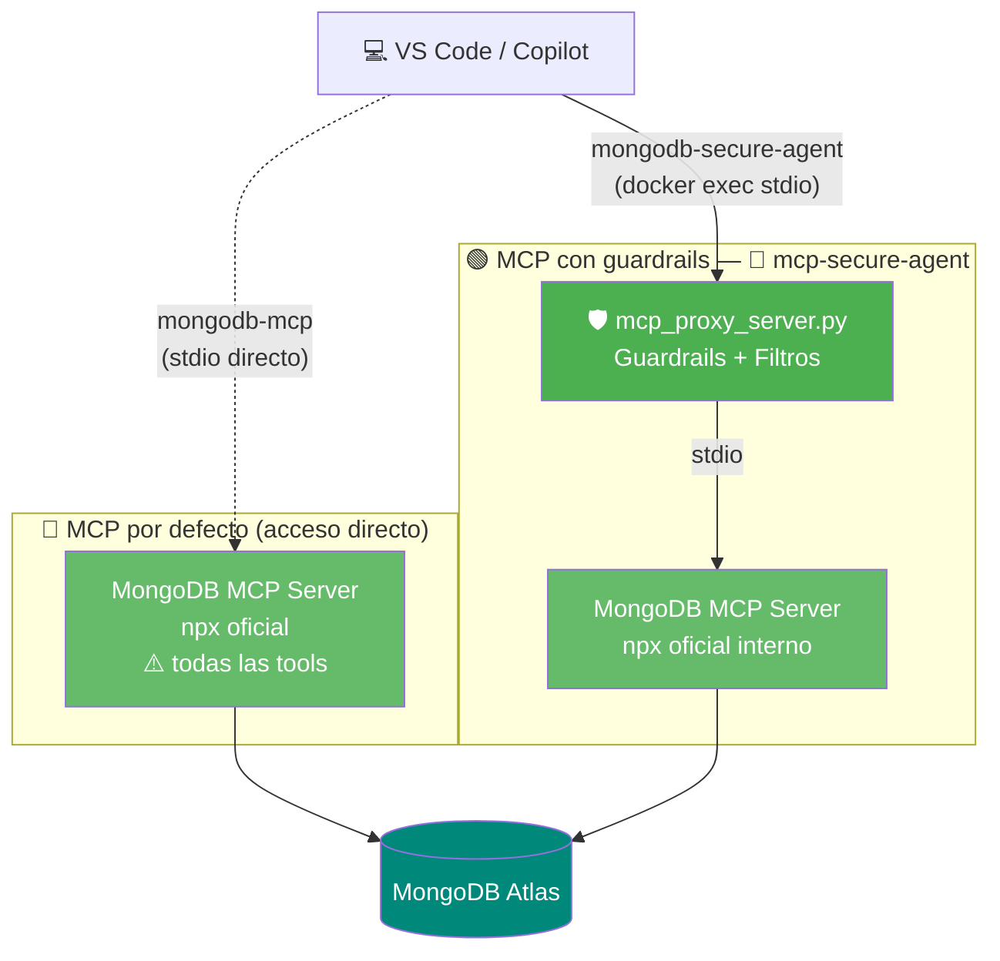
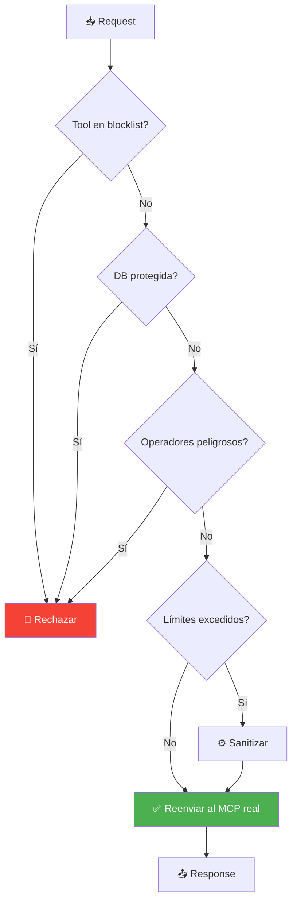
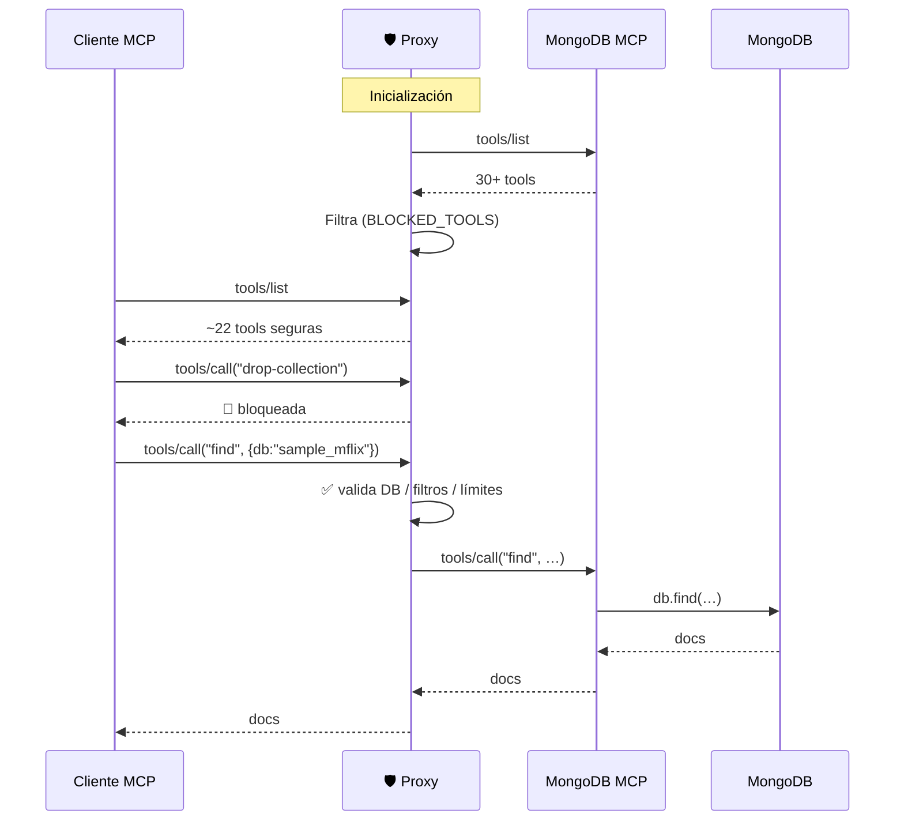

# Agent Control — MongoDB MCP con Guardrails

> Proyecto educativo que muestra cómo exponer **MongoDB** a un LLM mediante **MCP** (Model Context Protocol) añadiendo una capa de **guardrails de seguridad** apta para producción.

---

## Video resumen

[](https://github.com/aesteban00/agent_control/releases/download/v0.1/README_video.mp4)

> Haz click en el GIF para descargar el vídeo completo (MP4).

### Timeline

| Minuto | Contenido |
|---|---|
| 00:00 | Revisión del repo |
| 04:48 | Configuración de guardrails |
| 05:55 | MongoDB Skills |
| 11:17 | Creación automática de índice **auto embedding** para búsqueda semántica |

---

## Índice

1. [¿Qué es MCP?](#1-qué-es-mcp)
2. [Aproximación por defecto — Conexión directa](#2-aproximación-por-defecto--conexión-directa)
3. [Problemas potenciales](#3-problemas-potenciales)
4. [Guardrails nativos del MongoDB MCP Server](#4-guardrails-nativos-del-mongodb-mcp-server)
5. [Arquitectura — Dos modos en paralelo](#5-arquitectura--dos-modos-en-paralelo)
6. [La solución: Proxy con guardrails](#6-la-solución-proxy-con-guardrails)
7. [Componentes del repo](#7-componentes-del-repo)
8. [Quick Start](#8-quick-start)
9. [Demos](#9-demos)
10. [Configuración de seguridad](#10-configuración-de-seguridad)
11. [Recursos](#11-recursos)

---

## 1. ¿Qué es MCP?

**Model Context Protocol** es un estándar abierto (Anthropic) que permite a los LLMs invocar *tools* y leer *resources* de servidores externos vía JSON-RPC.



El [MongoDB MCP Server oficial](https://www.mongodb.com/docs/mcp-server/) expone más de 30 [tools](https://www.mongodb.com/docs/mcp-server/tools/) (`find`, `aggregate`, `insert-*`, `drop-*`, `atlas-*`, …) que cubren consultas, escritura, schema y administración de Atlas.

---

## 2. Aproximación por defecto — Conexión directa

La configuración más sencilla es conectar VS Code (o cualquier cliente MCP) directamente al MongoDB MCP Server oficial vía `npx`. Esto da al LLM acceso completo al cluster sin ninguna capa de filtrado:



**Configuración de VS Code (`mcp.json`) para el modo directo:**

```json
{
  "mcpServers": {
    "mongodb-mcp": {
      "command": "sh",
      "args": [
        "-c",
        "set -a && . ${workspaceFolder}/.env && set +a && exec npx -y mongodb-mcp-server"
      ]
    }
  }
}
```

El wrapper `sh -c "set -a && . .env && ..."` exporta todas las variables de `.env` (incluidos `MONGODB_URI` y cualquier opción `MDB_MCP_*`) al subproceso `npx mongodb-mcp-server`.

---

## 3. Problemas potenciales

Conectar el MCP de MongoDB **directamente** al IDE/agente da al LLM acceso sin restricciones al cluster:



| Riesgo | Ejemplo | Impacto |
|---|---|---|
| Borrado masivo | `drop-database`, `delete-many` | 🔴 Pérdida de datos |
| Acceso a DBs sistema | `admin`, `local` | 🔴 Exposición de config |
| Injection | `$where`, `$function` | 🔴 Ejecución de código |
| DoS | Query sin límite | 🟡 Saturación |

---

## 4. Guardrails nativos del MongoDB MCP Server

Antes —o además— de poner un proxy, el propio [MongoDB MCP Server](https://www.mongodb.com/docs/mcp-server/) expone varias **opciones de configuración** que funcionan como guardrails de primer nivel. Se pueden definir como variables de entorno (`MDB_MCP_*`), flags CLI (`--opt`) o en un [fichero JSON](https://www.mongodb.com/docs/mcp-server/configuration/manual-file-configuration/) (`MDB_MCP_CONFIG`).

Referencias rápidas a la documentación oficial:

- [Configuration Options](https://www.mongodb.com/docs/mcp-server/configuration/options/) — listado completo de flags / variables.
- [Enable or Disable Features](https://www.mongodb.com/docs/mcp-server/configuration/enable-or-disable-features/) — modo read-only, index-check, dry-run, telemetry, etc.
- [Security](https://www.mongodb.com/docs/mcp-server/security/) y [Security Best Practices](https://www.mongodb.com/docs/mcp-server/security-best-practices/).
- [Tools](https://www.mongodb.com/docs/mcp-server/tools/) — qué tools existen y categorías para `disabledTools`.

### Tabla resumen — opciones tipo guardrail

| Variable de entorno (`MDB_MCP_…`) / Flag | Tipo | Default | Guardrail simulado |
|---|---|---|---|
| `READ_ONLY` / `--readOnly` | bool | `false` | **Modo solo lectura**: bloquea cualquier operación de escritura (`insert-*`, `update-*`, `delete-*`, `drop-*`). |
| `INDEX_CHECK` / `--indexCheck` | bool | `false` | **Rechaza queries sin índice** (collection scans). Evita escaneos completos accidentales. |
| `MAX_TIME_M_S` / `--maxTimeMS` | int (ms) | — | **Timeout por operación** (`find`, `aggregate`, `count`). Mata queries lentas / costosas. |
| `MAX_DOCUMENTS_PER_QUERY` *(override)* | int | — | Límite máximo de documentos devueltos por query — evita traer millones de documentos. |
| `MAX_BYTES_PER_QUERY` *(override)* | int | — | Límite de bytes por respuesta — corta payloads gigantes. |
| `DISABLED_TOOLS` / `--disabledTools` | array | — | Desactiva tools concretas, *operation types* (`delete`, `update`, `create`) o categorías enteras (`atlas`, `mongodb`). |
| `CONFIRMATION_REQUIRED_TOOLS` *(override)* | array | — | Fuerza confirmación humana antes de ejecutar tools sensibles. |
| `ALLOW_REQUEST_OVERRIDES` / `--allowRequestOverrides` | bool | `false` | Permite endurecer (no relajar) la config por petición vía headers HTTP. |
| `TELEMETRY` / `--telemetry` | string | `enabled` | Pon `disabled` para no enviar métricas de uso fuera de tu entorno. |
| `TRANSPORT` / `--transport` | string | `stdio` | Mantén `stdio` salvo necesidad real de HTTP. `http` sin auth fuerte = riesgo. |
| `HTTP_HOST` / `--httpHost` | string | `127.0.0.1` | No lo cambies a `0.0.0.0` sin auth: expone el MCP a la red. |
| `HTTP_BODY_LIMIT` / `--httpBodyLimit` | int (bytes) | `102400` | Limita tamaño de request — protege ante bodies maliciosos. |
| `IDLE_TIMEOUT_MS` | int (ms) | `600000` | Cierra sesiones HTTP ociosas — limita la ventana de abuso. |
| `EXPORT_TIMEOUT_MS` / `EXPORT_CLEANUP_INTERVAL_MS` | int (ms) | `300000` / `120000` | Vida y limpieza de ficheros exportados — evita acumular datos sensibles en disco. |
| `EXPORTS_PATH` / `LOG_PATH` | path | OS dep. | Apunta a un directorio con permisos restringidos al usuario del MCP. |
| `AUTHENTICATION_MECHANISM` | string | `SCRAM-SHA-256` | Forza mecanismos fuertes (OIDC, LDAP, Kerberos, X.509) según política. |
| `CONNECTION_STRING` | string | — | **Nunca** lo pases por CLI (queda en logs/contexto del LLM); usa la variable de entorno. |
| `DRY_RUN` / `--dryRun` | bool | `false` | Modo auditoría: imprime config y tools habilitadas sin ejecutar nada — útil para revisar guardrails antes de producción. |

> *(override)* indica que la opción aparece sólo en la **tabla de override behaviors** de la doc oficial. Define el límite global vía variable de entorno o JSON config; los clientes sólo pueden hacerlo más estricto si `allowRequestOverrides=true`.

### Ejemplo de configuración "endurecida" (sin proxy)

`mcp.json` de VS Code apuntando al MCP oficial **con guardrails nativos máximos**:

```json
{
  "mcpServers": {
    "mongodb-mcp-hardened": {
      "command": "npx",
      "args": [
        "-y", "@mongodb-js/mongodb-mcp-server",
        "--readOnly",
        "--indexCheck",
        "--maxTimeMS", "5000",
        "--disabledTools", "delete", "drop-collection", "drop-database", "atlas"
      ],
      "env": {
        "MDB_MCP_CONNECTION_STRING": "mongodb+srv://...",
        "MDB_MCP_TELEMETRY": "disabled",
        "MDB_MCP_MAX_DOCUMENTS_PER_QUERY": "100",
        "MDB_MCP_MAX_BYTES_PER_QUERY": "262144"
      }
    }
  }
}
```

### Equivalente vía fichero JSON (`MDB_MCP_CONFIG`)

```json
{
  "readOnly": true,
  "indexCheck": true,
  "maxTimeMS": 5000,
  "maxDocumentsPerQuery": 100,
  "maxBytesPerQuery": 262144,
  "disabledTools": ["delete", "drop-collection", "drop-database", "atlas"],
  "confirmationRequiredTools": ["update-one", "insert-one"],
  "telemetry": "disabled",
  "transport": "stdio"
}
```

> **Lo que los guardrails nativos NO cubren:** los operadores de injection (`$where`, `$function`, `$accumulator`) y el acceso a bases de datos de sistema concretas (`admin`, `local`, `config`) no están bloqueados de forma nativa. Aquí es donde el proxy de este repo aporta valor.

---

## 5. Arquitectura — Dos modos en paralelo

El proyecto está pensado para **comparar lado a lado** dos formas de conectar VS Code a MongoDB Atlas:

- **MCP por defecto** — `mongodb-mcp`: VS Code lanza vía `npx` el MCP oficial de MongoDB con su configuración estándar (todas las tools disponibles).
- **MCP con guardrails** — `mongodb-secure-agent`: VS Code habla con `mcp_proxy_server.py` (en Docker), que filtra tools y valida parámetros antes de delegar al MCP oficial.



### Comparativa de los dos modos

| Característica | 🔵 `mongodb-mcp` (por defecto) | 🟢 `mongodb-secure-agent` (proxy) |
|---|---|---|
| Ubicación | Local (`npx`) | Container Docker |
| Tools expuestas | Todas (30+) | Filtradas (~22) |
| `drop-*`, `delete-many`, `insert-many` | ✅ permitido | 🚫 bloqueado |
| `find` / `aggregate` | sin límites | máx. 100 docs / 10 stages |
| DBs `admin`, `local`, `config` | accesibles | 🚫 protegidas |
| Operadores `$where`, `$function` | permitidos | 🚫 bloqueados |
| Uso recomendado | Desarrollo / exploración | Producción |

---

## 6. La solución: Proxy con guardrails

`mcp_proxy_server.py` se interpone entre el cliente MCP y el servidor de MongoDB: descubre las tools dinámicamente, filtra las peligrosas y valida los parámetros.



Características:

- **Descubrimiento dinámico** — adopta automáticamente nuevas tools del MCP oficial.
- **Blocklist configurable** — `BLOCKED_TOOLS` en `SecurityConfig`.
- **Validación de parámetros** — DB destino, operadores, pipelines.
- **Límites automáticos** — `MAX_LIMIT`, `MAX_PIPELINE_STAGES`.
- **Logging de seguridad** — registra cada intento bloqueado.

### Flujo de descubrimiento dinámico



> **Defensa en profundidad**: las opciones nativas son el primer cinturón (cubren read-only, index-check, timeouts y límites de resultados). El proxy de este repo añade lo que el MCP nativo **no** ofrece: protección de DBs concretas, bloqueo de operadores de injection y discovery dinámico con blocklist.

### Riesgos vs. opción nativa que los mitiga

| Riesgo | Opción nativa | Refuerzo en este proxy |
|---|---|---|
| Borrado / escritura accidental | `READ_ONLY=true` | `BLOCKED_TOOLS` (drop-*, delete-many, …) |
| Collection scan sobre colecciones grandes | `INDEX_CHECK=true` | — |
| Query que devuelve millones de documentos | `MAX_DOCUMENTS_PER_QUERY`, `MAX_BYTES_PER_QUERY` | `MAX_LIMIT=100` |
| Query / aggregation eterna | `MAX_TIME_M_S` | `MAX_PIPELINE_STAGES=10` |
| Tools peligrosas habilitadas | `DISABLED_TOOLS` (`delete`, `drop-*`, `atlas-*`) | `BLOCKED_TOOLS` |
| Acción destructiva sin revisión | `CONFIRMATION_REQUIRED_TOOLS` | bloqueo total en proxy |
| Operadores de injection (`$where`, `$function`) | — *(no cubierto nativamente)* | `BLOCKED_OPERATORS` ✅ |
| DBs de sistema (`admin`, `local`, `config`) | — *(no cubierto nativamente)* | `PROTECTED_DATABASES` ✅ |
| Exposición de credenciales al LLM | usar `MDB_MCP_CONNECTION_STRING` env, no CLI | — |
| Exposición HTTP no controlada | `transport=stdio`, `httpHost=127.0.0.1` | — |
| Telemetría hacia fuera | `TELEMETRY=disabled` | — |

---

## 7. Componentes del repo

```
agent_control/
├── mcp_proxy_server.py   # 🛡️ Proxy MCP con guardrails (componente principal)
├── mcp_client.py         # Cliente STDIO al MongoDB MCP oficial
├── docker-compose.yml    # Servicio: mcp-secure-agent
├── Dockerfile.mcp        # Imagen Python + Node.js (para mongodb-mcp-server)
├── requirements.txt
└── .env(.example)
```

| Archivo | Rol |
|---|---|
| `mcp_proxy_server.py` | Proxy stdio con guardrails — lo que conecta VS Code |
| `mcp_client.py` | Lanza `mongodb-mcp-server` como subproceso y habla JSON-RPC |

---

## 8. Quick Start

**Prerrequisitos:** Docker, VS Code con Copilot, connection string de MongoDB Atlas.

```bash
git clone <repo> && cd agent_control
cp .env.example .env       # rellena MONGODB_URI y claves

docker compose up -d --build mcp-secure-agent
docker ps --filter name=mcp-secure-agent
```

Configura el cliente MCP de VS Code (`~/.vscode/mcp.json` o `.vscode/mcp.json`):

```json
{
  "mcpServers": {
    "mongodb-mcp": {
      "command": "sh",
      "args": [
        "-c",
        "set -a && . ${workspaceFolder}/.env && set +a && exec npx -y mongodb-mcp-server"
      ]
    },
    "mongodb-secure-agent": {
      "command": "docker",
      "args": ["exec", "-i", "mcp-secure-agent", "python3", "mcp_proxy_server.py"]
    }
  }
}
```

Ambos servidores leen su configuración (incluido `MONGODB_URI` y los guardrails nativos `MDB_MCP_*`) del fichero `.env`:

- `mongodb-mcp` (local) — el wrapper `sh -c "set -a && . .env && ..."` exporta las variables al subproceso `npx mongodb-mcp-server`.
- `mongodb-secure-agent` (Docker) — `docker-compose.yml` carga `.env` con `env_file`, y el proxy las propaga al MCP oficial interno.

Reinicia VS Code y verás **ambos servidores** disponibles en Copilot Chat.

---

## 9. Demos — MCP por defecto vs MCP con guardrails

La demo central consiste en lanzar **la misma instrucción** contra los dos servidores y comprobar la diferencia.

### Demo 1 · Operación destructiva

```text
🔵 @mongodb-mcp drop-collection sample_mflix movies
   → ✅ Colección eliminada  (¡PELIGRO! datos perdidos)

🟢 @mongodb-secure-agent drop-collection sample_mflix movies
   → 🚫 Tool 'drop-collection' bloqueada por políticas de seguridad.
```

### Demo 2 · Acceso a DBs de sistema

```text
🔵 @mongodb-mcp find admin system.users
   → ✅ Devuelve credenciales / configuración interna

🟢 @mongodb-secure-agent find admin system.users
   → 🚫 Acceso denegado: 'admin' está protegida.
```

### Demo 3 · Query legítima (ambos funcionan)

```text
🔵 @mongodb-mcp           find sample_mflix movies {"year": 2020}
🟢 @mongodb-secure-agent  find sample_mflix movies {"year": 2020}
   → ✅ [{"title": "Soul", …}, …]
```

### Demo 4 · Límites automáticos del proxy

```text
🔵 @mongodb-mcp           find sample_mflix movies {} 1000
   → ✅ Devuelve 1000 documentos (posible DoS)

🟢 @mongodb-secure-agent  find sample_mflix movies {} 1000
   → ✅ Devuelve máx. 100 documentos (límite aplicado silenciosamente)
```

---

## 10. Configuración de seguridad

Edita `SecurityConfig` en `mcp_proxy_server.py`:

```python
class SecurityConfig:
    BLOCKED_TOOLS = {
        "drop-collection", "drop-database", "drop-index",
        "delete-many", "insert-many", "update-many",
    }
    PROTECTED_DATABASES = {"admin", "local", "config"}
    BLOCKED_OPERATORS  = {"$where", "$function", "$accumulator"}
    MAX_LIMIT = 100
    MAX_PIPELINE_STAGES = 10
```

Cuando MongoDB publique una nueva versión del MCP oficial, el proxy descubrirá las tools nuevas en el siguiente arranque; basta con revisar y, si procede, añadirlas a `BLOCKED_TOOLS`.

| Guardrail | Mecanismo | Propósito |
|---|---|---|
| Tool blocklist | `BLOCKED_TOOLS` | Elimina ops destructivas |
| Protección de DB | `PROTECTED_DATABASES` | Aísla DBs de sistema |
| Filtro de operadores | `BLOCKED_OPERATORS` | Previene injection |
| Límite de resultados | `MAX_LIMIT` | Evita DoS |
| Límite de pipeline | `MAX_PIPELINE_STAGES` | Limita complejidad |
| Discovery dinámico | `list_tools()` | Adaptación a updates |

---

## 11. Recursos

- [MongoDB MCP Server — Documentación oficial](https://www.mongodb.com/docs/mcp-server/)
- [Overview](https://www.mongodb.com/docs/mcp-server/overview/) · [Get Started](https://www.mongodb.com/docs/mcp-server/get-started/) · [Prerequisites](https://www.mongodb.com/docs/mcp-server/prerequisites/)
- [Configure](https://www.mongodb.com/docs/mcp-server/configuration/) — [Options](https://www.mongodb.com/docs/mcp-server/configuration/options/) · [Methods](https://www.mongodb.com/docs/mcp-server/configuration/methods/) · [Enable or Disable Features](https://www.mongodb.com/docs/mcp-server/configuration/enable-or-disable-features/) · [Manual File Configuration](https://www.mongodb.com/docs/mcp-server/configuration/manual-file-configuration/)
- [Tools](https://www.mongodb.com/docs/mcp-server/tools/) · [Usage Examples](https://www.mongodb.com/docs/mcp-server/examples/)
- [Security](https://www.mongodb.com/docs/mcp-server/security/) · [Security Best Practices](https://www.mongodb.com/docs/mcp-server/security-best-practices/)
- [Troubleshooting](https://www.mongodb.com/docs/mcp-server/configuration/troubleshooting/) · [Release Notes](https://www.mongodb.com/docs/mcp-server/release-notes/)
