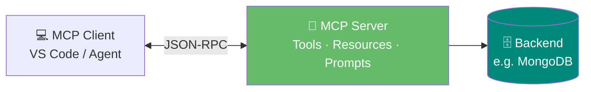
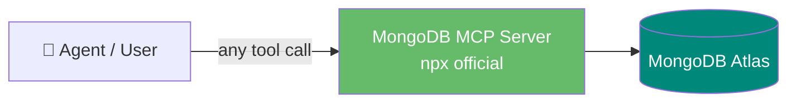
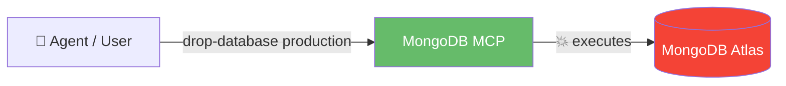
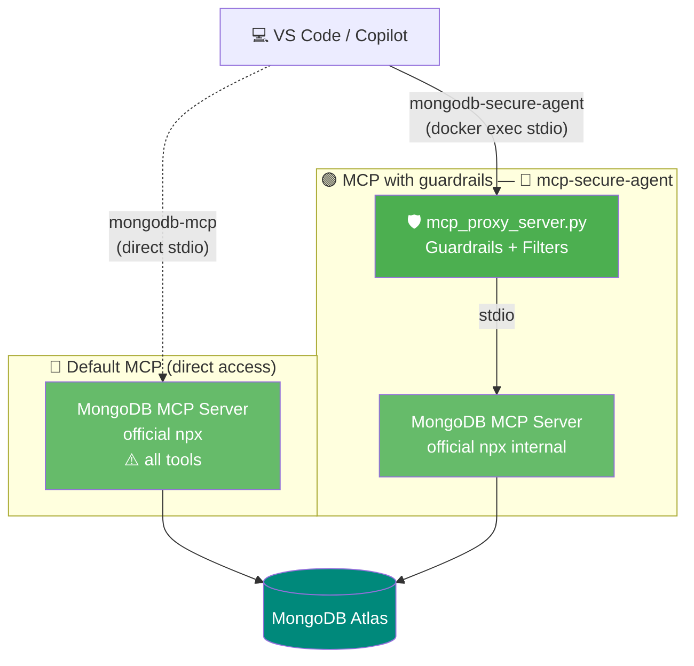
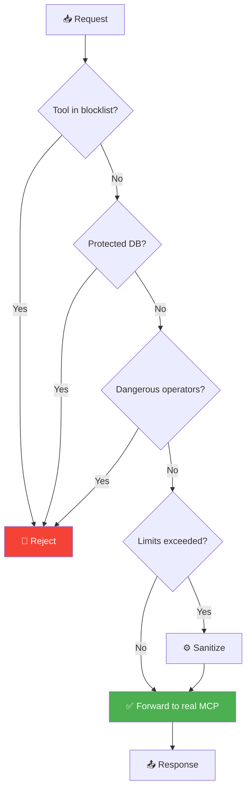
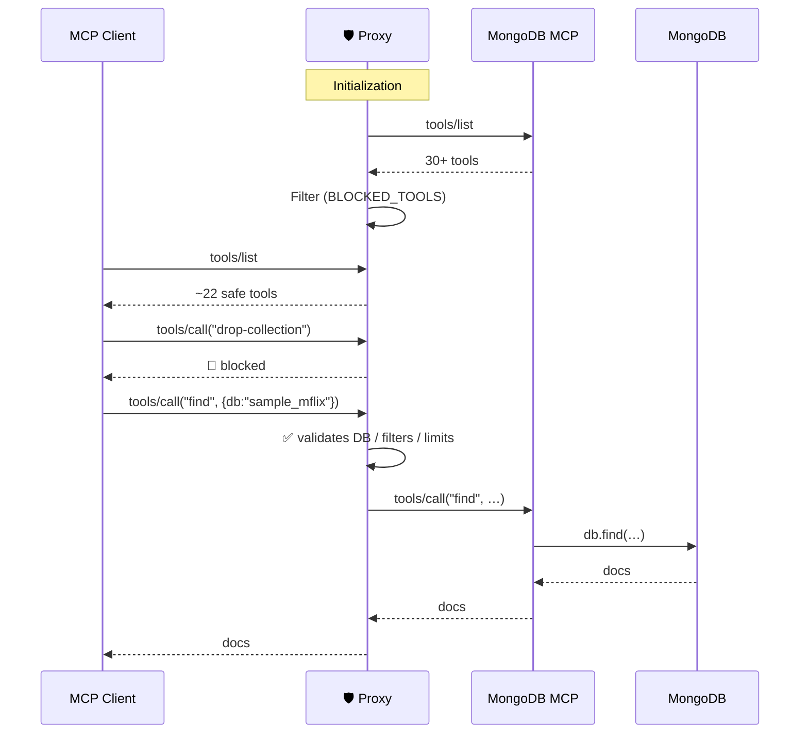

# Agent Control — MongoDB MCP with Guardrails

> An educational project showing how to expose **MongoDB** to an LLM via **MCP** (Model Context Protocol) with a production-ready **security guardrails** layer.

---

## Video summary

[](https://github.com/aesteban00/agent_control/releases/download/v0.1/README_video.mp4)

> Click the GIF to download the full video (MP4).

### Timeline

| Timestamp | Content |
|---|---|
| 00:00 | Repository walkthrough |
| 04:48 | Guardrails configuration |
| 05:55 | MongoDB Skills |
| 11:17 | Automatic creation of an **auto embedding** index for semantic search |

---

## Table of Contents

1. [What is MCP?](#1-what-is-mcp)
2. [Default Approach — Direct Connection](#2-default-approach--direct-connection)
3. [Potential Problems](#3-potential-problems)
4. [Native Guardrails of the MongoDB MCP Server](#4-native-guardrails-of-the-mongodb-mcp-server)
5. [Architecture — Two Modes Side by Side](#5-architecture--two-modes-side-by-side)
6. [The Solution: Proxy with Guardrails](#6-the-solution-proxy-with-guardrails)
7. [Repository Components](#7-repository-components)
8. [Quick Start](#8-quick-start)
9. [Demos](#9-demos)
10. [Security Configuration](#10-security-configuration)
11. [Resources](#11-resources)

---

## 1. What is MCP?

**Model Context Protocol** is an open standard (Anthropic) that allows LLMs to invoke *tools* and read *resources* from external servers via JSON-RPC.



The [official MongoDB MCP Server](https://www.mongodb.com/docs/mcp-server/) exposes more than 30 [tools](https://www.mongodb.com/docs/mcp-server/tools/) (`find`, `aggregate`, `insert-*`, `drop-*`, `atlas-*`, …) covering queries, writes, schema management, and Atlas administration.

---

## 2. Default Approach — Direct Connection

The simplest setup is to connect VS Code (or any MCP client) directly to the official MongoDB MCP Server via `npx`. This gives the LLM full access to the cluster with no filtering layer:



**VS Code configuration (`mcp.json`) for direct mode:**

```json
{
  "mcpServers": {
    "mongodb-mcp": {
      "command": "sh",
      "args": [
        "-c",
        "set -a && . ${workspaceFolder}/.env && set +a && exec npx -y mongodb-mcp-server"
      ]
    }
  }
}
```

The wrapper `sh -c "set -a && . .env && ..."` exports all variables from `.env` (including `MONGODB_URI` and any `MDB_MCP_*` options) to the `npx mongodb-mcp-server` subprocess.

---

## 3. Potential Problems

Connecting the MongoDB MCP **directly** to the IDE/agent gives the LLM unrestricted access to the cluster:



| Risk | Example | Impact |
|---|---|---|
| Mass deletion | `drop-database`, `delete-many` | 🔴 Data loss |
| Access to system DBs | `admin`, `local` | 🔴 Config exposure |
| Injection | `$where`, `$function` | 🔴 Code execution |
| DoS | Unbounded query | 🟡 Resource exhaustion |

---

## 4. Native Guardrails of the MongoDB MCP Server

Before — or in addition to — adding a proxy, the [MongoDB MCP Server](https://www.mongodb.com/docs/mcp-server/) itself exposes several **configuration options** that act as first-level guardrails. They can be set as environment variables (`MDB_MCP_*`), CLI flags (`--opt`), or in a [JSON config file](https://www.mongodb.com/docs/mcp-server/configuration/manual-file-configuration/) (`MDB_MCP_CONFIG`).

Quick references to the official documentation:

- [Configuration Options](https://www.mongodb.com/docs/mcp-server/configuration/options/) — full list of flags / variables.
- [Enable or Disable Features](https://www.mongodb.com/docs/mcp-server/configuration/enable-or-disable-features/) — read-only mode, index-check, dry-run, telemetry, etc.
- [Security](https://www.mongodb.com/docs/mcp-server/security/) and [Security Best Practices](https://www.mongodb.com/docs/mcp-server/security-best-practices/).
- [Tools](https://www.mongodb.com/docs/mcp-server/tools/) — available tools and categories for `disabledTools`.

### Summary table — guardrail-type options

| Env variable (`MDB_MCP_…`) / Flag | Type | Default | Guardrail |
|---|---|---|---|
| `READ_ONLY` / `--readOnly` | bool | `false` | **Read-only mode**: blocks all write operations (`insert-*`, `update-*`, `delete-*`, `drop-*`). |
| `INDEX_CHECK` / `--indexCheck` | bool | `false` | **Rejects queries without an index** (collection scans). Prevents accidental full scans. |
| `MAX_TIME_M_S` / `--maxTimeMS` | int (ms) | — | **Per-operation timeout** (`find`, `aggregate`, `count`). Kills slow / expensive queries. |
| `MAX_DOCUMENTS_PER_QUERY` *(override)* | int | — | Maximum documents returned per query — prevents fetching millions of documents. |
| `MAX_BYTES_PER_QUERY` *(override)* | int | — | Response size limit — cuts off giant payloads. |
| `DISABLED_TOOLS` / `--disabledTools` | array | — | Disables specific tools, *operation types* (`delete`, `update`, `create`), or entire categories (`atlas`, `mongodb`). |
| `CONFIRMATION_REQUIRED_TOOLS` *(override)* | array | — | Forces human confirmation before executing sensitive tools. |
| `ALLOW_REQUEST_OVERRIDES` / `--allowRequestOverrides` | bool | `false` | Allows tightening (not relaxing) the config per request via HTTP headers. |
| `TELEMETRY` / `--telemetry` | string | `enabled` | Set to `disabled` to avoid sending usage metrics outside your environment. |
| `TRANSPORT` / `--transport` | string | `stdio` | Keep `stdio` unless HTTP is genuinely needed. `http` without strong auth = risk. |
| `HTTP_HOST` / `--httpHost` | string | `127.0.0.1` | Do not change to `0.0.0.0` without auth: exposes the MCP to the network. |
| `HTTP_BODY_LIMIT` / `--httpBodyLimit` | int (bytes) | `102400` | Limits request size — protects against malicious bodies. |
| `IDLE_TIMEOUT_MS` | int (ms) | `600000` | Closes idle HTTP sessions — limits the abuse window. |
| `EXPORT_TIMEOUT_MS` / `EXPORT_CLEANUP_INTERVAL_MS` | int (ms) | `300000` / `120000` | Lifetime and cleanup of exported files — prevents accumulating sensitive data on disk. |
| `EXPORTS_PATH` / `LOG_PATH` | path | OS dep. | Point to a directory with permissions restricted to the MCP user. |
| `AUTHENTICATION_MECHANISM` | string | `SCRAM-SHA-256` | Enforce strong mechanisms (OIDC, LDAP, Kerberos, X.509) per policy. |
| `CONNECTION_STRING` | string | — | **Never** pass via CLI (ends up in logs/LLM context); use the environment variable instead. |
| `DRY_RUN` / `--dryRun` | bool | `false` | Audit mode: prints config and enabled tools without executing anything — useful to review guardrails before production. |

> *(override)* indicates the option only appears in the **override behaviors table** of the official docs. Set the global limit via environment variable or JSON config; clients can only make it stricter if `allowRequestOverrides=true`.

### Example "hardened" configuration (without proxy)

VS Code `mcp.json` pointing to the official MCP **with maximum native guardrails**:

```json
{
  "mcpServers": {
    "mongodb-mcp-hardened": {
      "command": "npx",
      "args": [
        "-y", "@mongodb-js/mongodb-mcp-server",
        "--readOnly",
        "--indexCheck",
        "--maxTimeMS", "5000",
        "--disabledTools", "delete", "drop-collection", "drop-database", "atlas"
      ],
      "env": {
        "MDB_MCP_CONNECTION_STRING": "mongodb+srv://...",
        "MDB_MCP_TELEMETRY": "disabled",
        "MDB_MCP_MAX_DOCUMENTS_PER_QUERY": "100",
        "MDB_MCP_MAX_BYTES_PER_QUERY": "262144"
      }
    }
  }
}
```

### Equivalent via JSON file (`MDB_MCP_CONFIG`)

```json
{
  "readOnly": true,
  "indexCheck": true,
  "maxTimeMS": 5000,
  "maxDocumentsPerQuery": 100,
  "maxBytesPerQuery": 262144,
  "disabledTools": ["delete", "drop-collection", "drop-database", "atlas"],
  "confirmationRequiredTools": ["update-one", "insert-one"],
  "telemetry": "disabled",
  "transport": "stdio"
}
```

> **What native guardrails do NOT cover:** injection operators (`$where`, `$function`, `$accumulator`) and access to specific system databases (`admin`, `local`, `config`) are not blocked natively. This is where the proxy in this repo adds value.

---

## 5. Architecture — Two Modes Side by Side

This project is designed to **compare side by side** two ways of connecting VS Code to MongoDB Atlas:

- **Default MCP** — `mongodb-mcp`: VS Code launches the official MongoDB MCP via `npx` with its standard configuration (all tools available).
- **MCP with guardrails** — `mongodb-secure-agent`: VS Code talks to `mcp_proxy_server.py` (in Docker), which filters tools and validates parameters before delegating to the official MCP.



### Comparison of the two modes

| Feature | 🔵 `mongodb-mcp` (default) | 🟢 `mongodb-secure-agent` (proxy) |
|---|---|---|
| Location | Local (`npx`) | Docker container |
| Exposed tools | All (30+) | Filtered (~22) |
| `drop-*`, `delete-many`, `insert-many` | ✅ allowed | 🚫 blocked |
| `find` / `aggregate` | no limits | max 100 docs / 10 stages |
| DBs `admin`, `local`, `config` | accessible | 🚫 protected |
| Operators `$where`, `$function` | allowed | 🚫 blocked |
| Recommended use | Development / exploration | Production |

---

## 6. The Solution: Proxy with Guardrails

`mcp_proxy_server.py` sits between the MCP client and the MongoDB server: it dynamically discovers tools, filters dangerous ones, and validates parameters.



Features:

- **Dynamic discovery** — automatically adopts new tools from the official MCP.
- **Configurable blocklist** — `BLOCKED_TOOLS` in `SecurityConfig`.
- **Parameter validation** — target DB, operators, pipelines.
- **Automatic limits** — `MAX_LIMIT`, `MAX_PIPELINE_STAGES`.
- **Security logging** — records every blocked attempt.

### Dynamic discovery flow



> **Defence in depth**: native options are the first belt (covering read-only, index-check, timeouts, and result limits). The proxy in this repo adds what the native MCP **does not** offer: protection of specific databases, injection operator blocking, and dynamic discovery with blocklist.

### Risks vs. native option that mitigates them

| Risk | Native option | Reinforcement in this proxy |
|---|---|---|
| Accidental deletion / write | `READ_ONLY=true` | `BLOCKED_TOOLS` (drop-*, delete-many, …) |
| Collection scan on large collections | `INDEX_CHECK=true` | — |
| Query returning millions of documents | `MAX_DOCUMENTS_PER_QUERY`, `MAX_BYTES_PER_QUERY` | `MAX_LIMIT=100` |
| Endless query / aggregation | `MAX_TIME_M_S` | `MAX_PIPELINE_STAGES=10` |
| Dangerous tools enabled | `DISABLED_TOOLS` (`delete`, `drop-*`, `atlas-*`) | `BLOCKED_TOOLS` |
| Destructive action without review | `CONFIRMATION_REQUIRED_TOOLS` | total block in proxy |
| Injection operators (`$where`, `$function`) | — *(not covered natively)* | `BLOCKED_OPERATORS` ✅ |
| System DBs (`admin`, `local`, `config`) | — *(not covered natively)* | `PROTECTED_DATABASES` ✅ |
| Credentials exposed to the LLM | use `MDB_MCP_CONNECTION_STRING` env, not CLI | — |
| Uncontrolled HTTP exposure | `transport=stdio`, `httpHost=127.0.0.1` | — |
| Outbound telemetry | `TELEMETRY=disabled` | — |

---

## 7. Repository Components

```
agent_control/
├── mcp_proxy_server.py   # 🛡️ MCP Proxy with guardrails (main component)
├── mcp_client.py         # STDIO client to the official MongoDB MCP
├── docker-compose.yml    # Service: mcp-secure-agent
├── Dockerfile.mcp        # Python + Node.js image (for mongodb-mcp-server)
├── requirements.txt
└── .env(.example)
```

| File | Role |
|---|---|
| `mcp_proxy_server.py` | stdio proxy with guardrails — what VS Code connects to |
| `mcp_client.py` | Launches `mongodb-mcp-server` as a subprocess and speaks JSON-RPC |

---

## 8. Quick Start

**Prerequisites:** Docker, VS Code with Copilot, MongoDB Atlas connection string.

```bash
git clone <repo> && cd agent_control
cp .env.example .env       # fill in MONGODB_URI and keys

docker compose up -d --build mcp-secure-agent
docker ps --filter name=mcp-secure-agent
```

Configure the VS Code MCP client (`~/.vscode/mcp.json` or `.vscode/mcp.json`):

```json
{
  "mcpServers": {
    "mongodb-mcp": {
      "command": "sh",
      "args": [
        "-c",
        "set -a && . ${workspaceFolder}/.env && set +a && exec npx -y mongodb-mcp-server"
      ]
    },
    "mongodb-secure-agent": {
      "command": "docker",
      "args": ["exec", "-i", "mcp-secure-agent", "python3", "mcp_proxy_server.py"]
    }
  }
}
```

Both servers read their configuration (including `MONGODB_URI` and native guardrails `MDB_MCP_*`) from the `.env` file:

- `mongodb-mcp` (local) — the `sh -c "set -a && . .env && ..."` wrapper exports the variables to the `npx mongodb-mcp-server` subprocess.
- `mongodb-secure-agent` (Docker) — `docker-compose.yml` loads `.env` with `env_file`, and the proxy propagates them to the internal official MCP.

Restart VS Code and you will see **both servers** available in Copilot Chat.

---

## 9. Demos — Default MCP vs MCP with Guardrails

The core demo consists of running **the same instruction** against both servers and observing the difference.

### Demo 1 · Destructive operation

```text
🔵 @mongodb-mcp drop-collection sample_mflix movies
   → ✅ Collection deleted  (DANGER! data lost)

🟢 @mongodb-secure-agent drop-collection sample_mflix movies
   → 🚫 Tool 'drop-collection' blocked by security policy.
```

### Demo 2 · Access to system databases

```text
🔵 @mongodb-mcp find admin system.users
   → ✅ Returns credentials / internal configuration

🟢 @mongodb-secure-agent find admin system.users
   → 🚫 Access denied: 'admin' is protected.
```

### Demo 3 · Legitimate query (both work)

```text
🔵 @mongodb-mcp           find sample_mflix movies {"year": 2020}
🟢 @mongodb-secure-agent  find sample_mflix movies {"year": 2020}
   → ✅ [{"title": "Soul", …}, …]
```

### Demo 4 · Automatic proxy limits

```text
🔵 @mongodb-mcp           find sample_mflix movies {} 1000
   → ✅ Returns 1000 documents (potential DoS)

🟢 @mongodb-secure-agent  find sample_mflix movies {} 1000
   → ✅ Returns max. 100 documents (limit silently applied)
```

---

## 10. Security Configuration

Edit `SecurityConfig` in `mcp_proxy_server.py`:

```python
class SecurityConfig:
    BLOCKED_TOOLS = {
        "drop-collection", "drop-database", "drop-index",
        "delete-many", "insert-many", "update-many",
    }
    PROTECTED_DATABASES = {"admin", "local", "config"}
    BLOCKED_OPERATORS  = {"$where", "$function", "$accumulator"}
    MAX_LIMIT = 100
    MAX_PIPELINE_STAGES = 10
```

When MongoDB publishes a new version of the official MCP, the proxy will discover the new tools on the next startup; simply review them and, if appropriate, add them to `BLOCKED_TOOLS`.

| Guardrail | Mechanism | Purpose |
|---|---|---|
| Tool blocklist | `BLOCKED_TOOLS` | Removes destructive operations |
| DB protection | `PROTECTED_DATABASES` | Isolates system databases |
| Operator filter | `BLOCKED_OPERATORS` | Prevents injection |
| Result limit | `MAX_LIMIT` | Prevents DoS |
| Pipeline limit | `MAX_PIPELINE_STAGES` | Limits complexity |
| Dynamic discovery | `list_tools()` | Adapts to upstream updates |

---

## 11. Resources

- [MongoDB MCP Server — Official Documentation](https://www.mongodb.com/docs/mcp-server/)
- [Overview](https://www.mongodb.com/docs/mcp-server/overview/) · [Get Started](https://www.mongodb.com/docs/mcp-server/get-started/) · [Prerequisites](https://www.mongodb.com/docs/mcp-server/prerequisites/)
- [Configure](https://www.mongodb.com/docs/mcp-server/configuration/) — [Options](https://www.mongodb.com/docs/mcp-server/configuration/options/) · [Methods](https://www.mongodb.com/docs/mcp-server/configuration/methods/) · [Enable or Disable Features](https://www.mongodb.com/docs/mcp-server/configuration/enable-or-disable-features/) · [Manual File Configuration](https://www.mongodb.com/docs/mcp-server/configuration/manual-file-configuration/)
- [Tools](https://www.mongodb.com/docs/mcp-server/tools/) · [Usage Examples](https://www.mongodb.com/docs/mcp-server/examples/)
- [Security](https://www.mongodb.com/docs/mcp-server/security/) · [Security Best Practices](https://www.mongodb.com/docs/mcp-server/security-best-practices/)
- [Troubleshooting](https://www.mongodb.com/docs/mcp-server/configuration/troubleshooting/) · [Release Notes](https://www.mongodb.com/docs/mcp-server/release-notes/)

